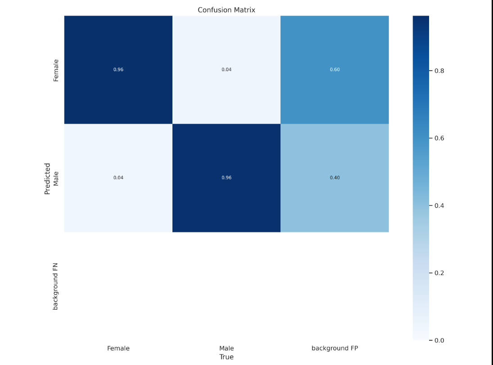

# Gender Identifier YOLOv5
 Identify if someone is a male or female based off of their face.
  
## Model  
Trained with the YOLOv5 computer vision library. Has over 90% accuracy(see confusion matrix below).  
  

## Dataset
Soontosh scraped and annotated his own, custom dataset. Contains over 2.6k images.  
Dataset can be found here: https://universe.roboflow.com/generalstuff/women-men/dataset/1

## What's changed
Webcam -> Use Image File.
Send to websocket -> Save the resulting image.
